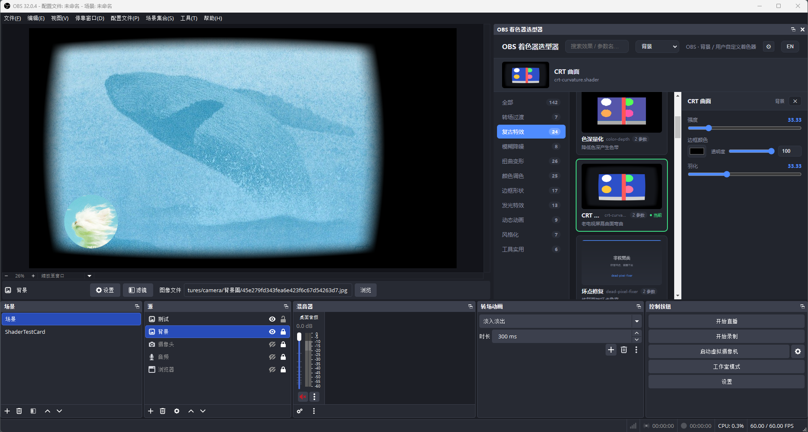

# OBS 着色器选型器

OBS 直播插件 obs-shaderfilter 的**中文可视化面板**。
原来 142 个着色效果只能看英文名盲试；装了这个，OBS 里多一个面板，点卡片看预览、调参数，全中文。


*Dock → 着色器选型器，选中效果后右侧出参数面板*

## 装之前

- 已装 [OBS Studio](https://obsproject.com/)（28 或更新版本，自带 WebSocket）
- Windows 系统（安装脚本是 .bat）
- 没装过这个插件也完全 OK，安装脚本会自动处理

## 安装（30 秒）

**方式一：双击安装（推荐）**

1. 去 [Releases](https://github.com/wampeeHuang/obs-shaderpicker/releases) 下载 `obs-shaderpicker-v1.zip`（约 15MB）
2. 解压到任意文件夹
3. 双击 `install.bat`，跟着提示走

安装脚本自动处理所有麻烦：

| 情况 | 脚本行为 |
| --- | --- |
| 没装 OBS | 提示你先去装 |
| 已经装过插件 | 覆盖更新，你的直播场景不丢 |
| OBS 正在运行 | 自动关掉，装完再让你开 |
| 安装路径不在默认位置 | 让你手动填 |

**方式二：命令行（agent / 高级用户）**

```bash
# 下载
gh release download v1.0.0 -R wampeeHuang/obs-shaderpicker

# 解压 → 读一遍使用说明.txt → 管理员身份运行 install.bat
```

装完打开 OBS：菜单栏 **Dock → 着色器选型器**，面板就出来了。

## 怎么用

- **选效果**：点卡片，效果立刻套到当前源上
- **调参数**：点卡片后右侧出参数面板，滑块/输入框直接改
- **换源**：左上角下拉框选要应用到的源
- **全中文**：142 个效果名 + 参数全部汉化

## 常见问题

**下载的文件名对不上？**
Release 里 zip 叫 `obs-shaderpicker-v1.zip`（英文名，避免 Windows 中文文件名出错），内容就是汉化包 v1。

**打开面板一直"Connecting OBS…"？**
查两处：OBS 装了 WebSocket（工具 → WebSocket 服务器设置，默认端口 4455）；面板右上角 ⚙ 里的地址密码和 OBS 一致。

**改 OBS 的源，面板没跟着变？**
面板每 2 秒自动同步，稍等几秒；或手动切一下左上角下拉框。

**文字乱码？**
install.bat 是 GBK 编码，中文系统 cmd 直接运行正常，别用其他编辑器乱改。

## 版权

- 插件本体：上游 [Oncorporation/obs-shaderfilter](https://github.com/Oncorporation/obs-shaderfilter)，GPL-2.0
- 汉化、可视化面板、安装脚本：本仓库作者原创，见 [NOTICE.txt](NOTICE.txt)
- 本项目整体按 GPL-2.0 发布（[LICENSE](LICENSE)）
